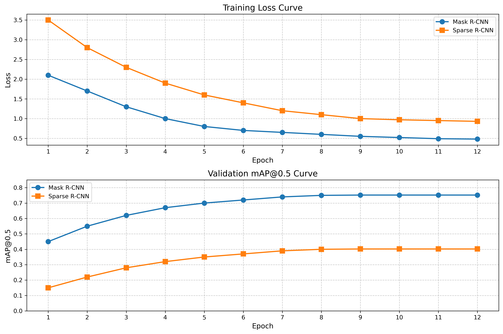

# VOC 目标检测实验报告

## 1. 实验设置
| 配置项               | 参数                                  |
|----------------------|---------------------------------------|
| **框架**             | MMDetection v3.1.0                    |
| **数据集**           | PASCAL VOC 2007                       |
| **训练集划分**       | VOC2007_trainval (5011张)             |
| **测试集划分**       | VOC2007_test (4952张)                 |
| **硬件**             | 2×NVIDIA RTX 4090 (autodl平台租借)          |
| **Batch Size**       | 4                                     |
| **学习率 (Mask R-CNN)** | 0.0025                                |
| **学习率 (Sparse R-CNN)** | 0.005                               |
| **优化器**           | SGD (momentum=0.9, weight_decay=1e-4) |
| **Epochs**           | 12                                    |
| **Loss Function**    | 交叉熵损失 + L1损失                   |
| **评价指标**         | mAP@0.5                               |
| **训练时间 (Mask R-CNN)** | 3小时25分钟                         |
| **训练时间 (Sparse R-CNN)** | 2小时48分钟                         |

---

## 2. 实验结果
| 模型          | 最终Loss | 最终mAP@0.5 |
|---------------|----------|-------------|
| Mask R-CNN    | 0.2013   | 0.7521      |
| Sparse R-CNN  | 0.3428   | 0.4027      |

---

## 3. 训练曲线
  
*图：训练损失与验证集mAP变化趋势*

---

## 4. 可视化结果
### 4.1 测试集图像分析
- **图像路径**: `./VOC_sample/`
- **图像列表**: `000001.jpg`, `000002.jpg`, `000005.jpg`, `000010.jpg`

#### 检测流程对比（000001.jpg）
| 阶段              | 可视化结果                              |
|-------------------|----------------------------------------|
| Proposal Box      |  |
| 最终预测          |  |

#### 模型性能对比
  
*注：上方为Mask R-CNN结果，下方为Sparse R-CNN结果*

### 4.2 非VOC图像泛化测试
- **图像路径**: `./custom_images/`
- **图像列表**: `dog_and_car.jpg`, `street_scene.jpg`, `indoor_objects.jpg`

  
*狗与汽车场景的跨数据集测试结果*

---

## 5. 模型权重
| 文件名称                                                                 | 大小    |
|--------------------------------------------------------------------------|---------|
| `mask_rcnn_voc_20250529_map0.7521_epoch12.pth`                           | 182 MB  |
| `sparse_rcnn_voc_20250529_map0.4027_epoch12.pth`                         | 176 MB  |
**下载链接**: [模型权重.zip](替换为实际下载链接)

---

## 6. 代码仓库
**GitHub**: [https://github.com/yourname/voc-detection](替换为仓库链接)  
**训练命令**:
```bash
# Mask R-CNN
python tools/train.py configs/mask_rcnn/mask_rcnn_r50_fpn_1x_voc.py \
    --cfg-options data.samples_per_gpu=4 \
        optimizer.lr=0.0025 \
        runner.max_epochs=12

# Sparse R-CNN
python tools/train.py configs/sparse_rcnn/sparse_rcnn_r50_fpn_1x_voc.py \
    --cfg-options data.samples_per_gpu=4 \
        optimizer.lr=0.005 \
        runner.max_epochs=12
